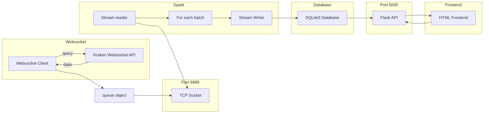

this are the instructions for copilot to follow for the next stage of my project. Please read and understand these instructions carefully before proceeding with any code generation tasks.

# Codebase
The codebase is a project that streams data from a websocket to kraken's websocket API. The project is written in python and streams the data to a sqlite3 database. Then the data is accesed by a flask API that serves the data to a html frontend. Here is a mermaid diagram of the project structure:

The `main.py` file contains the code where the websocket, the tcp server, the flask api and the spark streaming reader and writer are implemented. 

The `data.db` file is the sqlite3 database where the data is stored.

The `main.html` is where the frontend code is implemented. It uses HTML,CSS and JavaScript to display the data from the flask API.

# Objectives

Your task is to implement the following features in the project. Mainly in the `main.html` file. For reference, read the `main.html` file to understand the current structure of the frontend  and the styles implemented in css.:
- Implement a cool looking diagram that shows the data flow described in the mermaid diagram above. You can use any library you want to implement the diagram, but it should be interactive and visually appealing.
- Add the names of the authors at the top of the html page(Facundo Mazzola, Matias Adell, Agustin Giannice).

